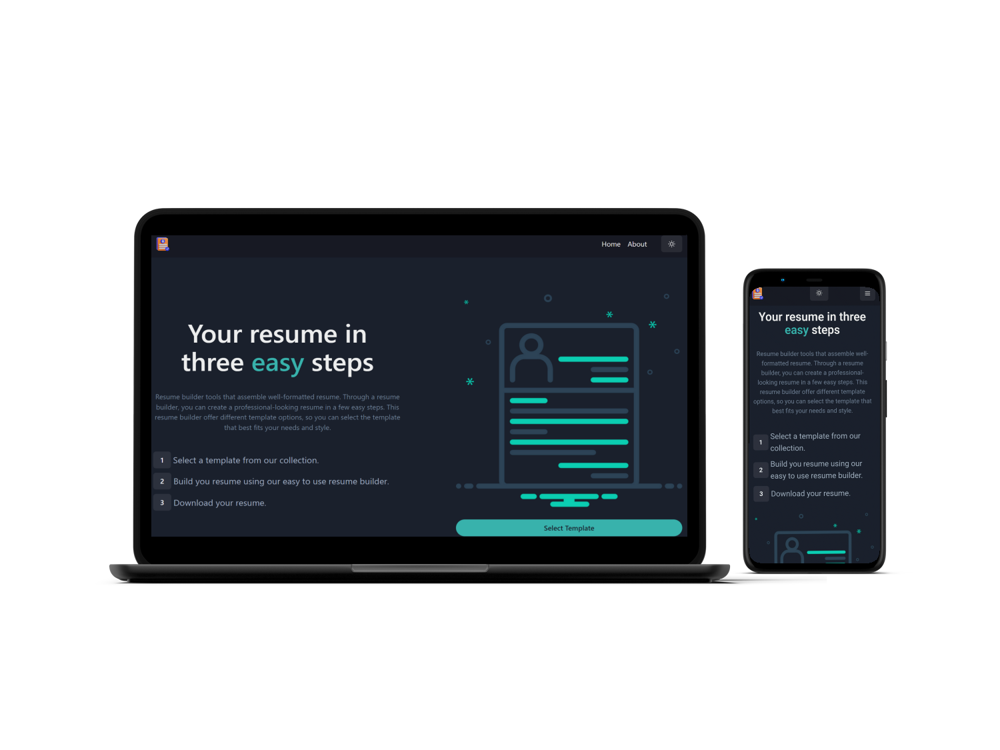

<div align="center">  
                                                                                           

   
  
[](https://twitter.com/intent/follow?screen_name=warrior_aashuu)

<hr>
  <h1 align="center">📋 Introducing to Resume Builder 📋</h1>
  
  <br><a href="https://resume-builder-pro.vercel.app/"><strong>Resume Builder</strong></a>
  <h4 align="center">✦ Create your Resume in minutes! ✦</h4>
  
  ` Resume Builder is a Web App where users can easily create professional and personalized resumes. `
<hr>
 <details>
    <summary>View Resume Builder Snapshot</summary>

###### Home Page


###### Select Template Page


###### Resume Builder Page


###### About Page


###### Light Mode

</details><hr>

  ` Features 🌟 `
</div>

```
  👌 User-friendly interface for creating and editing resumes
  📜 Templates to choose from for different job industries
  📑 PDF export option for final resume
  📲 Responsive Layout
  🌑 Dark mode for easy viewing
  👩🏻‍💼 Image upload for profile picture
```
<div align="center"><hr>
  
` Technologies Used 💻 Built With `

[React](https://reactjs.org/)  [Chakra UI](https://chakra-ui.com/)  [React Router](https://reactrouter.com/)  [React Icons](https://react-icons.github.io/react-icons/)  [React HTML to PDF](https://www.npmjs.com/package/react-html-to-pdf)  [Bootstrap](https://getbootstrap.com/)  <br><br>         <br><hr>

` © License ✔️ `

[](https://npmjs.org/package/badge-maker) [](https://npmjs.org/package/badge-maker) [](https://opensource.org/licenses/MIT)

This project is licensed under the NPM or MIT - see the [LICENSE](LICENSE) file for details. <hr>

` Getting Started 🚀 Setup Procedure ⚙️ `</div>

1. Clone this repository to your local machine
```bash
git clone https://github.com/codeaashu/Resume-Builder.git
```
2. Navigate to the project directory
```bash
cd resume-builder
```
3. Install dependencies
```bash
npm install
```
4. Run the app
```bash
npm run start
```
5. Open http://localhost:3000 in your browser to see the application running<hr>
<div align="center">
  
` Contributions 🫱🏻‍🫲🏼 `

We believe in the power of open-source contribution. so If you have a solid knowledge of React and you're interested in contributing to this project, I’d love to see what you can bring to the table. Feel free to fork the repository, add your resume template, and submit a pull request. Your contribution will be greatly appreciated. & Don't forget to install it on your devices Phone, Tablet, Laptop, PC anywhere you use.

`Don't forget to give A star to this repository ⭐`


`👍🏻 All Set! 💌`

</div>
