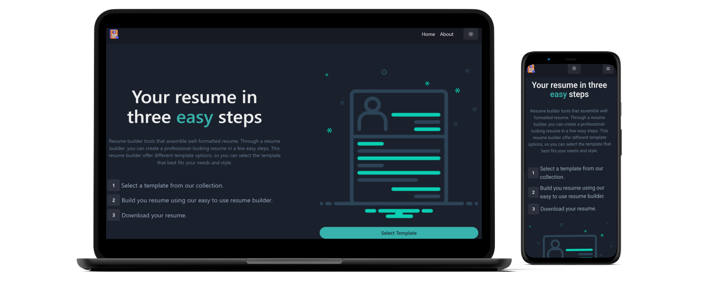

<div align="center">  
                                                                                           

   
  
[](https://twitter.com/intent/follow?screen_name=warrior_aashuu)

<hr>
  <h1 align="center">📋 Introducing to Resume Builder 📋</h1>
  
  <br><a href="https://resume-builder-pro.vercel.app/"><strong>Resume Builder</strong></a>
  <h4 align="center">✦ Create your Resume in minutes! ✦</h4>
  
  ` Resume Builder is a Web App where users can easily create professional and personalized resumes. `
<hr>
 <details>
    <summary>View Resume Builder Snapshot</summary>

###### Home Page


###### Select Template Page


###### Resume Builder Page


###### About Page


###### Light Mode

</details><hr>

## 🚀 Features

### 🎙️ 1. Simulate Real-Time Interviews  
Experience hyper-realistic, **voice-based interviews** with intelligent AI agents that mimic real interviewers — pressure and unpredictability included.

### 🧠 2. Personalized Feedback  
Get **instant, actionable insights** based on your tone, confidence, and clarity using real-time speech analysis.  
Antriview gives you the feedback that real interviewers never do — brutally honest, growth-focused, and always improving.

### 📊 3. Track Your Progress  
Monitor your communication skills with **visual analytics**, track your journey, and pinpoint **strengths and weaknesses**. Know exactly where you're growing — and where you need to level up.

### ⚡ 4. Fast Interview Creation  
Create full mock interviews in seconds using **conversational AI**.  
Skip the setup — just speak, and your personalized session begins.

### 🏫 5. Scalable for Institutions & Professionals  
Built for **universities, bootcamps, and career services**. Antriview offers bulk access, admin dashboards, and **performance insights** at scale.  
Because the future of hiring prep is not 1:1 — it’s scalable, smart, and voice-powered.

---

## 🛠️ Tech Stack

### 🔷 Frontend (UI & Real-Time Voice Interaction)
- **Next.js** – React-based framework for scalable frontends  
- **TypeScript** – Type-safe development  
- **Tailwind CSS** – Utility-first CSS for responsive styling  
- **shadcn/ui** – Accessible, modern UI components  
- **Vapi AI SDK** – Real-time voice assistant integration  
- **Zod** – Schema validation & safe form handling

### 🔶 Backend (Logic & AI Operations)
- **Next.js API Routes** – Serverless backend logic  
- **Firebase Authentication** – Secure auth (Email, Google)  
- **Firebase Cloud Functions** – AI handling, session management, feedback logic

### 🔵 Database (Persistent User & Interview Data)
- **Firebase Firestore** – NoSQL, real-time DB  
  - Stores: user profiles, interview responses, generated questions, feedback reports

### 🤖 AI & NLP (Voice Simulation & Feedback Intelligence)
- **Vapi AI** – Voice-based AI interviewer (input/output)  
- **Google Gemini API** – Natural language processing to:  
  - Generate adaptive interview questions  
  - Analyze spoken responses  
  - Deliver smart, contextual feedback  
  - Continuously learn from user performance

---

💡 _Antriview is not just a product. It’s a new standard in interview preparation._  
**"Your Ruthless, Real-Time AI Interviewer — Built for Pressure. Not Just Practice."**


  ` Features 🌟 `
</div>

```
  👌 User-friendly interface for creating and editing resumes
  📜 Templates to choose from for different job industries
  📑 PDF export option for final resume
  📲 Responsive Layout
  🌑 Dark mode for easy viewing
  👩🏻‍💼 Image upload for profile picture
```
<div align="center"><hr>
  
` Technologies Used 💻 Built With `

[React](https://reactjs.org/)  [Chakra UI](https://chakra-ui.com/)  [React Router](https://reactrouter.com/)  [React Icons](https://react-icons.github.io/react-icons/)  [React HTML to PDF](https://www.npmjs.com/package/react-html-to-pdf)  [Bootstrap](https://getbootstrap.com/)  <br><br>         <br><hr>

` © License ✔️ `

[](https://npmjs.org/package/badge-maker) [](https://npmjs.org/package/badge-maker) [](https://opensource.org/licenses/MIT)

This project is licensed under the NPM or MIT - see the [LICENSE](LICENSE) file for details. <hr>

` Getting Started 🚀 Setup Procedure ⚙️ `</div>

1. Clone this repository to your local machine
```bash
git clone https://github.com/codeaashu/Resume-Builder.git
```
2. Navigate to the project directory
```bash
cd resume-builder
```
3. Install dependencies
```bash
npm install
```
4. Run the app
```bash
npm run start
```
5. Open http://localhost:3000 in your browser to see the application running<hr>
<div align="center">
  
` Contributions 🫱🏻‍🫲🏼 `

We believe in the power of open-source contribution. so If you have a solid knowledge of React and you're interested in contributing to this project, I’d love to see what you can bring to the table. Feel free to fork the repository, add your resume template, and submit a pull request. Your contribution will be greatly appreciated. & Don't forget to install it on your devices Phone, Tablet, Laptop, PC anywhere you use.

`Don't forget to give A star to this repository ⭐`


`👍🏻 All Set! 💌`

</div>
